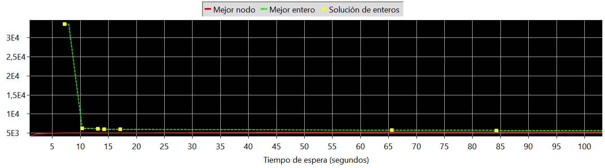

_Hacer un informe explicando como funciona la eliminación de subtours en cada modelo, ventajas y desventajas de ambos, comparación de tiempos de corrida
Notar que el modelo MTZ tiene todas las variables Xij mientras que el otro tiene un "ordered" por lo tanto solo tiene Xij cuando i < j, ¿por que es posible esto?, ¿cuando no es posible?, ¿que beneficios tiene?
Para el modelo MTZ incluir el gráfico de la solapa "Statistics", usar los primeros 100 seg (a los 120seg comienza a hacer scroll y se pierde el comienzo), explicarlo_

_Un poco más de detalle: Comparar los modelos, uno es MTZ y el otro de eliminación de subtours, el primero lo conocen, el segundo agarra un subtour, agrega una restricción para eliminarlo y vuelve a correr hasta que no haya, la idea es comparar esos dos modelos_

# Eliminación de subtours 

Un subtuour se forma cuando el modelo recorre todas las sucursales, pero por más de un camino cerrado. Para evitar que se formen, se pueden especificamente eliminar todos los subtours posibles. Por ejemplo, si salgo de una sucursal hacia otra, no puedo volver de la segunda a la primera. En este caso se está eliminando un subtour de 2 sucursales. Si se quiere eliminar uno de tres sucursales debe procurarse que si se sale de **A** hacia **B** y de **B** hacia **C**, no se pueda ir de **C** a **A**. En terminos de programación lineal, si Y~ij~ es 1 si voy de la sucursal _i_ a la sucursal _j_, entonces:

Y~AB~ + Y~BC~ + Y~AC~ <= 2

Si se tienen `n` sucursales, se deben eliminar los subtours de hasta `n/2 - 1` sucursales. Esta forma de eliminación de subtours es más rápida que la de MTZ, pero la cantidad de restricciones que agraga al modelo lo vuelve impracticable en problemas con un número elevado de sucursales. Para el caso de eliminar subtours de hasta 2 sucursales, si se tienen 5 sucursales en total, se deben agregar 5 + 4 + 3 + 2 restricciones.

MTZ plantea entonces establecer un orden de visita entre las sucursales, agregando una variable por cada sucursal (el orden en que es visitada). De esta manera, restringe los subtours a partir del orden de visita, estableciendo que, si no se va de una sucursal a otra, la máxima diferencia entre estas debe ser menor a las cantidad de ciudades menos 1. Por el contrario, si se va de una a otra, obliga al modelo a que el orden de la segunda sea el siguiente al de la primera. Esto se plantea para cada par de sucursales. Se agregan restricciones, pero no tantas como en el caso anterior. Sin embargo, el tiempo es mucho mayor.

En nuestro caso, utilizando MTZ se alcanzó la solución luego de 30 minutos, mientras que eliminando subtours fue de 28 segundos.

_Modificar la heurísitica desarrollada en la segunda entrega para que no tenga en cuenta las capacidades
Para los dos modelos agregar como solución inicial la obtenida mediante la heurística, la inserción de solución inicial ya está implementada (está comentada), agrega el camino trivial 1 --> 2 --> .... --> n --> 1 (constante "values") y se inserta mediante "cplex1.addMIPStart(opl.x,opl.values)", indicar que impacto tiene agregar la solución que obtuvieron y explicar el por qué.
Para el modelo MTZ incluir el gráfico de la solapa "Statistics", usar los primeros 100 seg (a los 120seg comienza a hacer scroll y se pierde el comienzo), explicar la diferencia al incluir la solución inicial_

44 71 45 4 68 91 13 74 31 27 49 72 80 14 77 15 78 59 16 79 88 94 10 63 48 73 76 87 1 98 34 30 84 7 8 89 96 35 93 52 33 92 54 46 90 56 26 75 18 85 65 55 58 50 70 86 29 81 25 20 51 43 67 32 23 38 41 57 39 60 66 17 11 61 36 69 24 12 53 40 42 9 28 6 37 2 19 99 47 83 97 100 5 95 82 3 62 22 21 64

TSP con la solucion inicial obtenida con la heuristica del problema dos: 30 segundos

solution: 5249.622889689 /size: 100 /time: 342372.031 (12:30 min)
Ciudad 1: -1
Ciudad 2: 76
Ciudad 3: 41
Ciudad 4: 49
Ciudad 5: 95
Ciudad 6: 74
Ciudad 7: 8
Ciudad 8: 9
Ciudad 9: 72
Ciudad 10: 40
Ciudad 11: 62
Ciudad 12: 67
Ciudad 13: 52
Ciudad 14: 31
Ciudad 15: 33
Ciudad 16: 35
Ciudad 17: 61
Ciudad 18: 88
Ciudad 19: 77
Ciudad 20: 21
Ciudad 21: 44
Ciudad 22: 43
Ciudad 23: 27
Ciudad 24: 66
Ciudad 25: 20
Ciudad 26: 92
Ciudad 27: 55
Ciudad 28: 73
Ciudad 29: 79
Ciudad 30: 6
Ciudad 31: 54
Ciudad 32: 25
Ciudad 33: 15
Ciudad 34: 1
Ciudad 35: 12
Ciudad 36: 64
Ciudad 37: 75
Ciudad 38: 26
Ciudad 39: 58
Ciudad 40: 69
Ciudad 41: 56
Ciudad 42: 71
Ciudad 43: 23
Ciudad 44: 46
Ciudad 45: 48
Ciudad 46: 18
Ciudad 47: 70
Ciudad 48: 4
Ciudad 49: 28
Ciudad 50: 83
Ciudad 51: 22
Ciudad 52: 14
Ciudad 53: 68
Ciudad 54: 17
Ciudad 55: 85
Ciudad 56: 91
Ciudad 57: 57
Ciudad 58: 84
Ciudad 59: 36
Ciudad 60: 59
Ciudad 61: 63
Ciudad 62: 42
Ciudad 63: 5
Ciudad 64: 45
Ciudad 65: 86
Ciudad 66: 60
Ciudad 67: 24
Ciudad 68: 50
Ciudad 69: 65
Ciudad 70: 82
Ciudad 71: 47
Ciudad 72: 29
Ciudad 73: 3
Ciudad 74: 53
Ciudad 75: 89
Ciudad 76: 2
Ciudad 77: 32
Ciudad 78: 34
Ciudad 79: 37
Ciudad 80: 30
Ciudad 81: 80
Ciudad 82: 97
Ciudad 83: 90
Ciudad 84: 7
Ciudad 85: 87
Ciudad 86: 81
Ciudad 87: 0
Ciudad 88: 38
Ciudad 89: 10
Ciudad 90: 19
Ciudad 91: 51
Ciudad 92: 16
Ciudad 93: 13
Ciudad 94: 39
Ciudad 95: 96
Ciudad 96: 11
Ciudad 97: 93
Ciudad 98: 98
Ciudad 99: 78
Ciudad 100: 94

Corrida cn heuristica modificada para ciudades de problema 3
